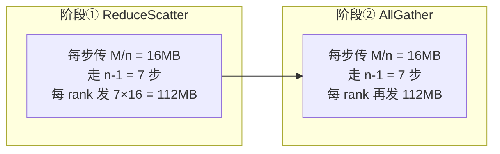

# AllReduce · busBw 推导与手算

> 源码位置：`rccl-tests/src/all_reduce.cu` 第 36-42 行
> 统一场景：n = 8 GPU，rccl-tests 命令行 `-b 134217728`（count = 128 MB）

<div align="center">

<style>
* { box-sizing: border-box; margin: 0; padding: 0; }
  :root {
    --surface: #ffffff; --surface-muted: #f6f6fb; --surface-soft: #eef0f7;
    --border: #e2e2ec; --text: #1a1a2e; --text-muted: #6b6b80;
    --brand: #7c5cff; --brand-strong: #5b3fd6; --brand-soft: #efebff;
    --font-sans: -apple-system, "PingFang SC", "Noto Sans CJK SC", "WenQuanYi Micro Hei", sans-serif;
    --font-mono: "SF Mono", "JetBrains Mono", "Menlo", monospace;
    --radius: 8px; --radius-card: 12px; --weight-medium: 500; --weight-strong: 700;
  }
  .bw-root { font-family: var(--font-sans); color: var(--text); background: var(--surface); border:1px solid var(--border); border-radius: var(--radius-card); padding: 20px; width: 100%; max-width: 880px; }
  .bw-title { font-size: 16px; font-weight: var(--weight-strong); margin: 0 0 4px; }
  .bw-sub { font-size: 12px; color: var(--text-muted); margin: 0 0 12px; }
  .bw-grid { display: flex; gap: 20px; align-items: stretch; }
  .bw-ring { flex: 0 0 300px; }
  .bw-derive { flex: 1; display: flex; flex-direction: column; gap: 10px; }
  .bw-derive-head { font-size: 13px; font-weight: var(--weight-medium); color: var(--text-muted); letter-spacing: .04em; text-transform: uppercase; }
  .bw-step { display: flex; gap: 10px; align-items: baseline; font-size: 14px; line-height: 1.5; }
  .bw-step .n { flex: 0 0 22px; font-family: var(--font-mono); font-size: 12px; color: var(--brand-strong); font-weight: var(--weight-strong); }
  .bw-step .t { font-family: var(--font-mono); font-size: 13px; }
  .bw-step .d { font-size: 12px; color: var(--text-muted); }
  .bw-concl { margin-top: 6px; padding: 12px 14px; background: var(--brand-soft); border:1px solid var(--brand); border-radius: var(--radius); font-size: 14px; line-height: 1.5; }
  .bw-concl .k { font-family: var(--font-mono); font-weight: var(--weight-strong); color: var(--brand-strong); }
  .bw-concl .h { font-size: 12px; color: var(--text-muted); margin-top: 4px; }
  .bw-legend { display: flex; gap: 16px; font-size: 12px; color: var(--text-muted); margin-top: 12px; flex-wrap: wrap; }
  .bw-legend span b { color: var(--text); font-weight: var(--weight-medium); }
</style>

  <div class="bw-root">
    <div class="bw-title">Ring AllReduce · busBw 理论上限推导</div>
    <div class="bw-sub">源码 all_reduce.cu: factor = 2(n−1)/n，n = 8 GPU，M = 128 MB</div>
    <div class="bw-grid">
      <div class="bw-ring">
        <svg viewBox="0 0 300 340" width="300" height="340" xmlns="http://www.w3.org/2000/svg">
          <defs>
            <marker id="ah" viewBox="0 0 8 8" refX="7" refY="4" markerWidth="8" markerHeight="8" markerUnits="userSpaceOnUse" orient="auto">
              <path d="M1 1 L7 4 L1 7 Z" fill="#7c5cff"/>
            </marker>
          </defs>
          <!-- Ring backbone -->
          <circle cx="150" cy="170" r="95" fill="none" stroke="#7c5cff" stroke-width="2.5" stroke-dasharray="4 3" opacity="0.55"/>
          <!-- Direction arrow on 0->1 arc -->
          <path d="M 233 198 A 95 95 0 0 1 217 237" fill="none" stroke="#7c5cff" stroke-width="2.5" marker-end="url(#ah)"/>
          <!-- 8 nodes -->
          <g font-family="SF Mono, monospace" font-size="12" fill="#1a1a2e" text-anchor="middle" dominant-baseline="central">
            <circle cx="245" cy="170" r="18" stroke="#7c5cff" fill="#ffffff" stroke-width="2"/><text x="245" y="170">G0</text>
            <circle cx="217" cy="237" r="18" stroke="#7c5cff" fill="#ffffff" stroke-width="2"/><text x="217" y="237">G1</text>
            <circle cx="150" cy="265" r="18" stroke="#7c5cff" fill="#ffffff" stroke-width="2"/><text x="150" y="265">G2</text>
            <circle cx="83"  cy="237" r="18" stroke="#7c5cff" fill="#ffffff" stroke-width="2"/><text x="83"  y="237">G3</text>
            <circle cx="55"  cy="170" r="18" stroke="#7c5cff" fill="#ffffff" stroke-width="2"/><text x="55"  y="170">G4</text>
            <circle cx="83"  cy="103" r="18" stroke="#7c5cff" fill="#ffffff" stroke-width="2"/><text x="83"  y="103">G5</text>
            <circle cx="150" cy="75"  r="18" stroke="#7c5cff" fill="#ffffff" stroke-width="2"/><text x="150" y="75">G6</text>
            <circle cx="217" cy="103" r="18" stroke="#7c5cff" fill="#ffffff" stroke-width="2"/><text x="217" y="103">G7</text>
          </g>
          <!-- center label -->
          <text x="150" y="166" text-anchor="middle" font-family="SF Mono, monospace" font-size="13" font-weight="700" fill="#5b3fd6">n = 8</text>
          <text x="150" y="184" text-anchor="middle" font-family="-apple-system, sans-serif" font-size="11" fill="#6b6b80">Ring 拓扑</text>
          <!-- stage annotations -->
          <g font-family="-apple-system, 'PingFang SC', sans-serif" font-size="11">
            <rect x="18" y="298" width="128" height="30" rx="6" fill="#efebff" stroke="#7c5cff"/>
            <text x="82" y="312" text-anchor="middle" fill="#5b3fd6" font-weight="600">阶段① ReduceScatter</text>
            <text x="82" y="324" text-anchor="middle" fill="#6b6b80">7 步 × 16 MB</text>
            <rect x="154" y="298" width="128" height="30" rx="6" fill="#efebff" stroke="#7c5cff"/>
            <text x="218" y="312" text-anchor="middle" fill="#5b3fd6" font-weight="600">阶段② AllGather</text>
            <text x="218" y="324" text-anchor="middle" fill="#6b6b80">7 步 × 16 MB</text>
          </g>
        </svg>
      </div>
      <div class="bw-derive">
        <div class="bw-derive-head">busBw 推导链</div>
        <div class="bw-step"><span class="n">1</span><span class="t">M = 128 MB, n = 8</span><span class="d">已知：总数据量与 GPU 数</span></div>
        <div class="bw-step"><span class="n">2</span><span class="t">每步传 M/n = 16 MB，每阶段 n−1 = 7 步</span><span class="d">数据均分 n 段，绕环传递 n−1 次即可聚合</span></div>
        <div class="bw-step"><span class="n">3</span><span class="t">T = 2(n−1)·M / (n·B)</span><span class="d">B = 单向链路带宽；两阶段各 7 步串行</span></div>
        <div class="bw-step"><span class="n">4</span><span class="t">algBw = M/T = n·B / [2(n−1)] = 8B/14 ≈ 0.571 B</span><span class="d">算法带宽：应用视角吞吐</span></div>
        <div class="bw-step"><span class="n">5</span><span class="t">busBw = algBw × 2(n−1)/n = (8B/14) × (14/8) = B ✓</span><span class="d">源码 factor = 2(n−1)/n，系数恰好消去</span></div>
        <div class="bw-concl">
          <div>理论上限：<span class="k">busBw = B</span>（单向链路带宽），与 n、M 无关</div>
          <div class="h">n 与 M 只影响能否"打满"链路（大消息才接近上限）；busBw 设计初衷就是消去算法系数，直接对标硬件带宽利用率</div>
        </div>
        <div class="bw-legend">
          <span>每步数据量 <b>M/n = 16 MB</b></span>
          <span>每阶段步数 <b>n−1 = 7</b></span>
          <span>两阶段总传输/GPU <b>2×7×16 = 224 MB</b></span>
          <span>factor <b>2(n−1)/n = 1.75</b></span>
        </div>
      </div>
    </div>
  </div>

</div>

## 一、源码公式

```c
void AllReduceGetBw(size_t count, int typesize, double sec,
                    double* algBw, double* busBw, int nranks) {
  double baseBw = (double)(count * typesize) / 1.0E9 / sec;
  *algBw = baseBw;
  double factor = ((double)(2*(nranks - 1)))/((double)nranks);
  *busBw = baseBw * factor;
}
```

- `count` = paramcount = 每 rank 输入/输出字节数 M（AllReduce 中 sendcount = recvcount = count）
- `baseBw` = M / T，即算法带宽 algBw
- `factor` = 2(n−1)/n，AllReduce 专属系数

## 二、参数含义（count = 128 MB, n = 8）

| 量 | 计算 | 值 |
|----|------|-----|
| count (paramcount) | 用户 -b 指定 | 128 MB |
| sendcount / rank | = count | 128 MB |
| recvcount / rank | = count | 128 MB |
| 每 rank 输入总数据 | M | 128 MB |

## 三、算法推导（Ring AllReduce）

Ring AllReduce 分两阶段，每阶段绕环 n−1 步：



- 每步数据量 = M/n = 128/8 = 16 MB
- 每阶段步数 = n−1 = 7
- 两阶段串行，每步耗时 = (M/n)/B（B = 单向链路带宽）
- 总时间：

```
T = 2(n-1) × (M/n) / B = 2 × 7 × 16MB / B = 224 MB / B
```

## 四、手算过程

设 B = 单向链路带宽。

| 步骤 | 公式 | 代入 n=8, M=128MB | 结果 |
|------|------|-------------------|------|
| 1. 每步数据量 | M/n | 128/8 | 16 MB |
| 2. 每阶段步数 | n−1 | 8−1 | 7 |
| 3. 总时间 T | 2(n−1)·M/(nB) | 2×7×128/(8B) | 224/B MB |
| 4. algBw | M/T | 128/(224/B) | 4B/7 ≈ 0.571 B |
| 5. factor | 2(n−1)/n | 2×7/8 | 1.75 |
| 6. **busBw** | algBw × factor | (4B/7) × 1.75 | **= B** |

## 五、理论上限结论

**busBw 理论上限 = B（单向链路带宽），与 n、M 无关。**

- factor = 2(n−1)/n 恰好抵消 Ring 两阶段的算法放大系数
- busBw 设计目的：消去算法系数，直接对标硬件链路带宽，衡量"链路利用率"
- 实测 busBw 越接近 B，说明 Ring 越高效
- 代入典型硬件：MI300X XGMI 单向 ~100 GB/s → busBw 上限 ≈ 100 GB/s；H100 NVLink 单向 50 GB/s → 上限 ≈ 50 GB/s

> **关键洞察**：AllReduce 是唯一 factor = 2(n−1)/n 的算子，因为它本质是 ReduceScatter + AllGather 两阶段串联，系数中的"2"来自两阶段。
