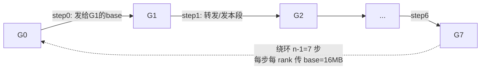

# AlltoAll · busBw 推导与手算

> 源码位置：`rccl-tests/src/alltoall.cu` 第 41-47 行
> 统一场景：n = 8 GPU，rccl-tests 命令行 `-b 134217728`（count = 128 MB）

<div align="center">

<style>
* { box-sizing: border-box; margin: 0; padding: 0; }
  :root {
    --surface: #ffffff; --surface-muted: #f6f6fb; --surface-soft: #eef0f7;
    --border: #e2e2ec; --text: #1a1a2e; --text-muted: #6b6b80;
    --brand: #7c5cff; --brand-strong: #5b3fd6; --brand-soft: #efebff;
    --font-sans: -apple-system, "PingFang SC", "Noto Sans CJK SC", "WenQuanYi Micro Hei", sans-serif;
    --font-mono: "SF Mono", "JetBrains Mono", "Menlo", monospace;
    --radius: 8px; --radius-card: 12px; --weight-medium: 500; --weight-strong: 700;
  }
  .bw-root { font-family: var(--font-sans); color: var(--text); background: var(--surface); border:1px solid var(--border); border-radius: var(--radius-card); padding: 20px; width: 100%; max-width: 880px; }
  .bw-title { font-size: 16px; font-weight: var(--weight-strong); margin: 0 0 4px; }
  .bw-sub { font-size: 12px; color: var(--text-muted); margin: 0 0 12px; }
  .bw-src { font-family: var(--font-mono); font-size: 11px; color: var(--text-muted); background: var(--surface-muted); padding: 7px 10px; border-radius: var(--radius); margin: 0 0 16px; line-height: 1.5; }
  .bw-grid { display: flex; gap: 20px; align-items: stretch; }
  .bw-ring { flex: 0 0 300px; }
  .bw-derive { flex: 1; display: flex; flex-direction: column; gap: 10px; }
  .bw-derive-head { font-size: 13px; font-weight: var(--weight-medium); color: var(--text-muted); letter-spacing: .04em; text-transform: uppercase; }
  .bw-step { display: flex; gap: 10px; align-items: baseline; font-size: 14px; line-height: 1.5; }
  .bw-step .n { flex: 0 0 22px; font-family: var(--font-mono); font-size: 12px; color: var(--brand-strong); font-weight: var(--weight-strong); }
  .bw-step .t { font-family: var(--font-mono); font-size: 13px; }
  .bw-step .d { font-size: 12px; color: var(--text-muted); }
  .bw-concl { margin-top: 6px; padding: 12px 14px; background: var(--brand-soft); border:1px solid var(--brand); border-radius: var(--radius); font-size: 14px; line-height: 1.5; }
  .bw-concl .k { font-family: var(--font-mono); font-weight: var(--weight-strong); color: var(--brand-strong); }
  .bw-concl .h { font-size: 12px; color: var(--text-muted); margin-top: 4px; }
  .bw-legend { display: flex; gap: 16px; font-size: 12px; color: var(--text-muted); margin-top: 12px; flex-wrap: wrap; }
  .bw-legend span b { color: var(--text); font-weight: var(--weight-medium); }
</style>

<div class="bw-root">
    <div class="bw-title">Ring AlltoAll · busBw 理论上限推导</div>
    <div class="bw-sub">源码 alltoall.cu: factor = (n−1)/n，n = 8 GPU，M = 128 MB</div>
    <div class="bw-src">baseBw = count*nranks*typesize / 1e9 / sec;&nbsp;&nbsp;factor = (n−1)/n;&nbsp;&nbsp;busBw = baseBw * factor</div>
    <div class="bw-grid">
      <div class="bw-ring">
        <svg viewBox="0 0 300 340" width="300" height="340" xmlns="http://www.w3.org/2000/svg">
          <defs>
            <marker id="ah" viewBox="0 0 8 8" refX="7" refY="4" markerWidth="8" markerHeight="8" markerUnits="userSpaceOnUse" orient="auto">
              <path d="M1 1 L7 4 L1 7 Z" fill="#7c5cff"/>
            </marker>
          </defs>
          <!-- 环形顺时针 G0->G1->G2->G3->G4->G5->G6->G7->G0 -->
          <line x1="238.1" y1="186.6" x2="224.1" y2="220.6" stroke="#7c5cff" stroke-width="2.5" marker-end="url(#ah)"/>
          <line x1="200.6" y1="244.1" x2="166.6" y2="258.1" stroke="#7c5cff" stroke-width="2.5" marker-end="url(#ah)"/>
          <line x1="133.4" y1="258.1" x2="99.4"  y2="244.1" stroke="#7c5cff" stroke-width="2.5" marker-end="url(#ah)"/>
          <line x1="75.9"  y1="220.6" x2="61.9"  y2="186.6" stroke="#7c5cff" stroke-width="2.5" marker-end="url(#ah)"/>
          <line x1="61.9"  y1="153.4" x2="75.9"  y2="119.4" stroke="#7c5cff" stroke-width="2.5" marker-end="url(#ah)"/>
          <line x1="99.4"  y1="95.9"  x2="133.4" y2="81.9"  stroke="#7c5cff" stroke-width="2.5" marker-end="url(#ah)"/>
          <line x1="166.6" y1="81.9"  x2="200.6" y2="95.9"  stroke="#7c5cff" stroke-width="2.5" marker-end="url(#ah)"/>
          <line x1="224.1" y1="119.4" x2="238.1" y2="153.4" stroke="#7c5cff" stroke-width="2.5" marker-end="url(#ah)"/>
          <!-- 每步每 pair 数据量 base=16MB 标注（节点间外侧） -->
          <g font-family="SF Mono, monospace" font-size="8" fill="#6b6b80" text-anchor="middle" dominant-baseline="central">
            <text x="254.5" y="213.3">16MB</text>
            <text x="193.3" y="274.5">16MB</text>
            <text x="106.7" y="274.5">16MB</text>
            <text x="45.5"  y="213.3">16MB</text>
            <text x="45.5"  y="126.7">16MB</text>
            <text x="106.7" y="65.5">16MB</text>
            <text x="193.3" y="65.5">16MB</text>
            <text x="254.5" y="126.7">16MB</text>
          </g>
          <!-- 节点（G0 高亮：参考 rank） -->
          <g font-family="SF Mono, monospace" font-size="12" fill="#1a1a2e" text-anchor="middle" dominant-baseline="central">
            <circle cx="245" cy="170" r="18" stroke="#7c5cff" fill="#efebff" stroke-width="2"/><text x="245" y="170">G0</text>
            <circle cx="217" cy="237" r="18" stroke="#7c5cff" fill="#ffffff" stroke-width="2"/><text x="217" y="237">G1</text>
            <circle cx="150" cy="265" r="18" stroke="#7c5cff" fill="#ffffff" stroke-width="2"/><text x="150" y="265">G2</text>
            <circle cx="83"  cy="237" r="18" stroke="#7c5cff" fill="#ffffff" stroke-width="2"/><text x="83"  y="237">G3</text>
            <circle cx="55"  cy="170" r="18" stroke="#7c5cff" fill="#ffffff" stroke-width="2"/><text x="55"  y="170">G4</text>
            <circle cx="83"  cy="103" r="18" stroke="#7c5cff" fill="#ffffff" stroke-width="2"/><text x="83"  y="103">G5</text>
            <circle cx="150" cy="75"  r="18" stroke="#7c5cff" fill="#ffffff" stroke-width="2"/><text x="150" y="75">G6</text>
            <circle cx="217" cy="103" r="18" stroke="#7c5cff" fill="#ffffff" stroke-width="2"/><text x="217" y="103">G7</text>
          </g>
          <!-- 底部阶段标注 -->
          <rect x="67" y="298" width="166" height="30" rx="6" fill="#efebff" stroke="#7c5cff" stroke-width="1"/>
          <text x="150" y="313" text-anchor="middle" dominant-baseline="central" font-family="SF Mono, monospace" font-size="10" fill="#1a1a2e">全交换 AlltoAll · 7 步 × 16 MB</text>
        </svg>
      </div>
      <div class="bw-derive">
        <div class="bw-derive-head">busBw 推导链</div>
        <div class="bw-step"><span class="n">1</span><span class="t">M = 128 MB, n = 8</span><span class="d">每 pair 交换 base = M/n = 16MB，每 rank 应用层总收发 128MB</span></div>
        <div class="bw-step"><span class="n">2</span><span class="t">每步每 rank 传 base = 16 MB 给当前环邻居</span><span class="d">走 n−1 = 7 步，环形轮转目的地</span></div>
        <div class="bw-step"><span class="n">3</span><span class="t">T = (n−1)·base / B = (n−1)·M / (n·B)</span><span class="d">总传输量除以单向链路带宽</span></div>
        <div class="bw-step"><span class="n">4</span><span class="t">algBw = M/T = n·B/(n−1) = 8B/7 ≈ 1.143 B</span><span class="d">有效数据量 / 耗时</span></div>
        <div class="bw-step"><span class="n">5</span><span class="t">busBw = algBw × (n−1)/n = (8B/7)×(7/8) = B ✓</span><span class="d">乘以源码 factor = (n−1)/n</span></div>
        <div class="bw-concl">
          <div>busBw = <span class="k">B</span>。</div>
          <div class="h">与 AllGather 环结构相同但数据流向不同——AllGather 聚合副本，AlltoAll 分发不同段</div>
        </div>
        <div class="bw-legend">
          <span>每 pair 数据 <b>base=16MB</b></span>
          <span>步数 <b>n−1=7</b></span>
          <span>每 rank 链路传输 <b>7×16=112MB</b></span>
          <span>factor <b>(n−1)/n=0.875</b></span>
        </div>
      </div>
    </div>
  </div>

</div>

## 一、源码公式

```c
void AlltoAllGetBw(size_t count, int typesize, double sec,
                   double* algBw, double* busBw, int nranks) {
  double baseBw = (double)(count * nranks * typesize) / 1.0E9 / sec;
  *algBw = baseBw;
  double factor = ((double)(nranks-1))/((double)(nranks));
  *busBw = baseBw * factor;
}
```

- `count` = paramcount = base = 每 pair 交换的字节数（每 rank 给每个其他 rank 发 base）
- `baseBw` = base × n / T = 每 rank 总收发量 / T
- `factor` = (n−1)/n

## 二、参数含义（用户 -b 128MB, n = 8）

AlltoAllGetCollByteCount 中：`paramcount = (count/nranks)`，即 128MB 被 n 等分为每-pair 数据量。

| 量 | 计算 | 值 |
|----|------|-----|
| 用户 -b count | 原始指定 | 128 MB |
| base = paramcount | count/n | 16 MB（每 pair）|
| sendcount / rank | = base×n | 128 MB（发给所有 rank）|
| recvcount / rank | = base×n | 128 MB（收自所有 rank）|
| baseBw 对应数据 | paramcount×n | 128 MB |

## 三、算法推导（Ring AlltoAll）

AlltoAll 是 all→all 全交换：每 rank 给每个其他 rank 发 base，共 n−1 个目的。Ring AlltoAll 绕环 n−1 步：



- 每步每 rank 发送 base = 16 MB（给当前环邻居的那一段）
- 步数 = n−1 = 7
- 每步耗时 = base/B
- 总时间：

```
T = (n-1) × base / B = 7 × 16MB / B = 112 MB / B
```

> 注：AlltoAll 与 AllGather 的环结构相同，但每步携带的数据"目的地"不同——AllGather 是聚合自己段，AlltoAll 是分发各段到对应 rank。

## 四、手算过程

设 B = 单向链路带宽，M = 128MB（每 rank 总收发量）。

| 步骤 | 公式 | 代入 n=8, M=128MB | 结果 |
|------|------|-------------------|------|
| 1. 每 pair 数据 | base = M/n | 128/8 | 16 MB |
| 2. 步数 | n−1 | 8−1 | 7 |
| 3. 总时间 T | (n−1)·base/B = (n−1)·M/(nB) | 7×128/(8B) | 112/B MB |
| 4. algBw (baseBw) | M/T | 128/(112/B) | 8B/7 ≈ 1.143 B |
| 5. factor | (n−1)/n | 7/8 | 0.875 |
| 6. **busBw** | algBw × factor | (8B/7)×(7/8) | **= B** |

## 五、理论上限结论

**busBw 理论上限 = B（单向链路带宽），与 n、M 无关。**

- AlltoAll 与 AllGather/ReduceScatter 的 factor 相同 ((n−1)/n)，因为三者都是单阶段环、每 rank 在 n−1 步内完成跨 rank 数据移动
- algBw = 8B/7 ≈ 1.143B > B，因为每 rank 的"有用数据"是 n 份 pair 数据，而链路只转发其中 n−1 份（不发给自己）
- factor (n−1)/n 抵消这层放大

> **与 AllGather 的区别**：AllGather 每 rank 最终拿到相同副本（数据冗余），AlltoAll 每 rank 拿到不同的分段（无冗余），但传输结构对称，故 busBw 上限同为 B。
