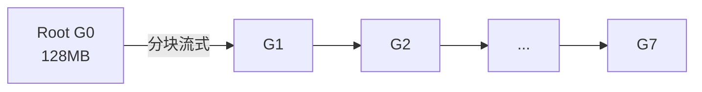
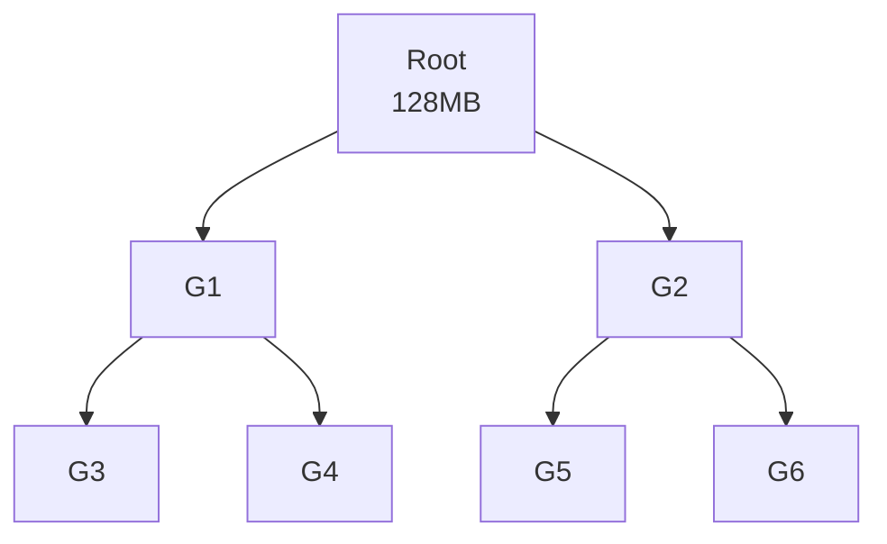

# Broadcast · busBw 推导与手算

> 源码位置：`rccl-tests/src/broadcast.cu` 第 35-41 行
> 统一场景：n = 8 GPU，rccl-tests 命令行 `-b 134217728`（count = 128 MB）

<div align="center">

<style>
* { box-sizing: border-box; margin: 0; padding: 0; }
  :root {
    --surface: #ffffff; --surface-muted: #f6f6fb; --surface-soft: #eef0f7;
    --border: #e2e2ec; --text: #1a1a2e; --text-muted: #6b6b80;
    --brand: #7c5cff; --brand-strong: #5b3fd6; --brand-soft: #efebff;
    --font-sans: -apple-system, "PingFang SC", "Noto Sans CJK SC", "WenQuanYi Micro Hei", sans-serif;
    --font-mono: "SF Mono", "JetBrains Mono", "Menlo", monospace;
    --radius: 8px; --radius-card: 12px; --weight-medium: 500; --weight-strong: 700;
  }
  .bw-root { font-family: var(--font-sans); color: var(--text); background: var(--surface); border:1px solid var(--border); border-radius: var(--radius-card); padding: 20px; width: 100%; max-width: 880px; }
  .bw-title { font-size: 16px; font-weight: var(--weight-strong); margin: 0 0 4px; }
  .bw-sub { font-size: 12px; color: var(--text-muted); margin: 0 0 16px; }
  .bw-grid { display: flex; gap: 20px; align-items: stretch; }
  .bw-ring { flex: 0 0 300px; }
  .bw-derive { flex: 1; display: flex; flex-direction: column; gap: 10px; }
  .bw-derive-head { font-size: 13px; font-weight: var(--weight-medium); color: var(--text-muted); letter-spacing: .04em; text-transform: uppercase; }
  .bw-step { display: flex; gap: 10px; align-items: baseline; font-size: 14px; line-height: 1.5; }
  .bw-step .n { flex: 0 0 22px; font-family: var(--font-mono); font-size: 12px; color: var(--brand-strong); font-weight: var(--weight-strong); }
  .bw-step .t { font-family: var(--font-mono); font-size: 13px; }
  .bw-step .d { font-size: 12px; color: var(--text-muted); }
  .bw-concl { margin-top: 6px; padding: 12px 14px; background: var(--brand-soft); border:1px solid var(--brand); border-radius: var(--radius); font-size: 14px; line-height: 1.5; }
  .bw-concl .k { font-family: var(--font-mono); font-weight: var(--weight-strong); color: var(--brand-strong); }
  .bw-concl .h { font-size: 12px; color: var(--text-muted); margin-top: 4px; }
  .bw-legend { display: flex; gap: 16px; font-size: 12px; color: var(--text-muted); margin-top: 10px; flex-wrap: wrap; }
  .bw-legend span b { color: var(--text); font-weight: var(--weight-medium); }
</style>

<div class="bw-root">
    <div class="bw-title">Tree Broadcast · busBw 理论上限推导</div>
    <div class="bw-sub">源码 broadcast.cu: factor = 1，n = 8 GPU，M = 128 MB</div>
    <div class="bw-grid">
      <div class="bw-ring">
        <svg viewBox="0 0 300 340" width="300" height="340" xmlns="http://www.w3.org/2000/svg">
          <defs>
            <marker id="ah" markerWidth="8" markerHeight="8" refX="7" refY="4" orient="auto">
              <path d="M1 1 L7 4 L1 7 Z" fill="#7c5cff"/>
            </marker>
          </defs>
          <!-- 树形连线 父→子 向下 -->
          <g stroke="#7c5cff" stroke-width="2" fill="none">
            <line x1="139" y1="69"  x2="101" y2="116" marker-end="url(#ah)"/>
            <line x1="161" y1="69"  x2="199" y2="116" marker-end="url(#ah)"/>
            <line x1="82"  y1="146" x2="63"  y2="189" marker-end="url(#ah)"/>
            <line x1="98"  y1="146" x2="117" y2="189" marker-end="url(#ah)"/>
            <line x1="204" y1="147" x2="191" y2="188" marker-end="url(#ah)"/>
            <line x1="219" y1="145" x2="246" y2="190" marker-end="url(#ah)"/>
            <line x1="131" y1="222" x2="144" y2="263" marker-end="url(#ah)"/>
          </g>
          <!-- M=128MB 标注（root 旁） -->
          <g>
            <rect x="176" y="37" width="70" height="18" rx="6" fill="#efebff" stroke="#7c5cff" stroke-width="1"/>
            <text x="211" y="46" text-anchor="middle" dominant-baseline="central" font-size="11" fill="#1a1a2e">M=128MB</text>
          </g>
          <!-- 节点 -->
          <g font-size="12" fill="#1a1a2e" text-anchor="middle" dominant-baseline="central">
            <circle cx="150" cy="55"  r="18" stroke="#7c5cff" fill="#efebff" stroke-width="2"/><text x="150" y="55">G0</text>
            <circle cx="90"  cy="130" r="18" stroke="#7c5cff" fill="#ffffff" stroke-width="2"/><text x="90"  y="130">G1</text>
            <circle cx="210" cy="130" r="18" stroke="#7c5cff" fill="#ffffff" stroke-width="2"/><text x="210" y="130">G2</text>
            <circle cx="55"  cy="205" r="18" stroke="#7c5cff" fill="#ffffff" stroke-width="2"/><text x="55"  y="205">G3</text>
            <circle cx="125" cy="205" r="18" stroke="#7c5cff" fill="#ffffff" stroke-width="2"/><text x="125" y="205">G4</text>
            <circle cx="185" cy="205" r="18" stroke="#7c5cff" fill="#ffffff" stroke-width="2"/><text x="185" y="205">G5</text>
            <circle cx="255" cy="205" r="18" stroke="#7c5cff" fill="#ffffff" stroke-width="2"/><text x="255" y="205">G6</text>
            <circle cx="150" cy="280" r="18" stroke="#7c5cff" fill="#ffffff" stroke-width="2"/><text x="150" y="280">G7</text>
          </g>
          <!-- 底部标注 -->
          <g>
            <rect x="80" y="312" width="140" height="22" rx="6" fill="#efebff" stroke="#7c5cff" stroke-width="1"/>
            <text x="150" y="323" text-anchor="middle" dominant-baseline="central" font-size="12" fill="#1a1a2e">流水线树 · T ≈ M/B</text>
          </g>
        </svg>
      </div>
      <div class="bw-derive">
        <div class="bw-derive-head">推导链</div>
        <div style='font-family:"SF Mono","JetBrains Mono",Menlo,monospace;font-size:11px;color:#6b6b80;margin-top:-4px;'>源码 broadcast.cu: baseBw = count·typesize/1e9/sec · factor = 1 · busBw = baseBw</div>
        <div class="bw-step"><span class="n">1</span><span class="t">M = 128 MB, n = 8</span><span class="d">root 持有 128MB，广播给所有 rank</span></div>
        <div class="bw-step"><span class="n">2</span><span class="t">log₂n = 3</span><span class="d">二叉树深度，流水线分块逐级下推</span></div>
        <div class="bw-step"><span class="n">3</span><span class="t">T ≈ M / B</span><span class="d">流水线实现，root 出向链路持续满载</span></div>
        <div class="bw-step"><span class="n">4</span><span class="t">algBw = M/T ≈ B</span><span class="d">算法带宽逼近单链路带宽</span></div>
        <div class="bw-step"><span class="n">5</span><span class="t">busBw = algBw × 1 = B ✓</span><span class="d">factor=1，单链路瓶颈无需归一化</span></div>
        <div class="bw-concl">
          <div class="k">busBw = B（流水线实现下）</div>
          <div class="h">无流水线树 T=3M/B，busBw=B/3；RCCL 流水线使其逼近 B。Broadcast 是 1→all，root 出向链路天然瓶颈。</div>
        </div>
        <div class="bw-legend">
          <span>消息大小 <b>M=128MB</b></span>
          <span>树深 <b>log₂8=3</b></span>
          <span>流水线 <b>T≈M/B</b></span>
          <span>factor <b>1</b></span>
        </div>
      </div>
    </div>
  </div>

</div>

## 一、源码公式

```c
void BroadcastGetBw(size_t count, int typesize, double sec,
                    double* algBw, double* busBw, int nranks) {
  double baseBw = (double)(count * typesize) / 1.0E9 / sec;
  *algBw = baseBw;
  double factor = 1;
  *busBw = baseBw * factor;
}
```

- `count` = paramcount = M（广播的消息大小，root 发送、所有 rank 接收相同 M）
- `baseBw` = M / T
- `factor` = 1 → **busBw = algBw**

## 二、参数含义（用户 -b 128MB, n = 8）

BroadcastGetCollByteCount 中 sendcount = recvcount = count。

| 量 | 计算 | 值 |
|----|------|-----|
| count (paramcount) | 用户 -b | 128 MB |
| sendcount (root) | = count | 128 MB |
| recvcount / rank | = count | 128 MB |

## 三、算法推导（树形 / 环形广播）

Broadcast 是 1→all 操作。RCCL 对大消息用 Ring，对小消息用 Tree。

### Ring 广播（大消息）



- Root 将 M 分成 n 段，沿环流水线发送
- 理想流水线下 root 的出向链路持续满载，T ≈ M/B
- busBw = algBw = M/T ≈ M/(M/B) = B

### 树形广播（小消息）



- 二叉树深度 = log₂n = 3 层
- 无流水线时 T = log₂n · M/B = 3M/B → busBw = B/3
- 流水线树（RCCL 实际实现）将 M 分块逐级下推，T ≈ M/B → busBw ≈ B

## 四、手算过程

设 B = 单向链路带宽，M = 128MB。按 RCCL 大消息 Ring/流水线树计算：

| 步骤 | 公式 | 代入 n=8, M=128MB | 结果 |
|------|------|-------------------|------|
| 1. 消息大小 | M | - | 128 MB |
| 2. 总时间 T（流水线）| M/B | 128/B | 128/B MB |
| 3. algBw | M/T | 128/(128/B) | B |
| 4. factor | 1 | - | 1 |
| 5. **busBw** | algBw × 1 | B × 1 | **= B** |

> 对比：若为无流水线二叉树，T = 3M/B，busBw = B/3 ≈ 0.333B。RCCL 流水线实现使其逼近 B。

## 五、理论上限结论

**busBw 理论上限 = B（单向链路带宽），在流水线实现下达成。**

- factor = 1 意味着 busBw 直接等于 algBw，没有算法系数需要抵消
- 原因：Broadcast 是 1→all，root 出向链路是天然瓶颈，"有用数据" M 正好流经这条链路一次
- 与 AllReduce 不同：Broadcast 不存在多 rank 间的数据复用放大，所以无需归一化系数

> **factor = 1 的算子共性**：Broadcast、Reduce、SendRecv 都是"单链路瓶颈"型操作，busBw = algBw，上限直接由瓶颈链路决定。
