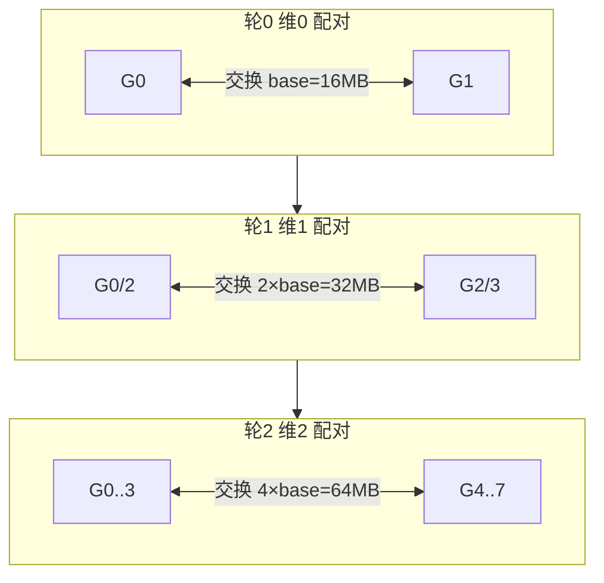

# HyperCube · busBw 推导与手算

> 源码位置：`rccl-tests/src/hypercube.cu` 第 41-47 行
> 统一场景：n = 8 GPU，rccl-tests 命令行 `-b 134217728`（count = 128 MB）

<div align="center">

<style>
* { box-sizing: border-box; margin: 0; padding: 0; }
  :root {
    --surface: #ffffff; --surface-muted: #f6f6fb; --surface-soft: #eef0f7;
    --border: #e2e2ec; --text: #1a1a2e; --text-muted: #6b6b80;
    --brand: #7c5cff; --brand-strong: #5b3fd6; --brand-soft: #efebff;
    --font-sans: -apple-system, "PingFang SC", "Noto Sans CJK SC", "WenQuanYi Micro Hei", sans-serif;
    --font-mono: "SF Mono", "JetBrains Mono", "Menlo", monospace;
    --radius: 8px; --radius-card: 12px; --weight-medium: 500; --weight-strong: 700;
  }
  .bw-root { font-family: var(--font-sans); color: var(--text); background: var(--surface); border:1px solid var(--border); border-radius: var(--radius-card); padding: 20px; width: 100%; max-width: 880px; }
  .bw-title { font-size: 16px; font-weight: var(--weight-strong); margin: 0 0 4px; }
  .bw-sub { font-size: 12px; color: var(--text-muted); margin: 0 0 16px; }
  .bw-grid { display: flex; gap: 20px; align-items: stretch; }
  .bw-ring { flex: 0 0 300px; }
  .bw-derive { flex: 1; display: flex; flex-direction: column; gap: 10px; }
  .bw-derive-head { font-size: 13px; font-weight: var(--weight-medium); color: var(--text-muted); letter-spacing: .04em; text-transform: uppercase; }
  .bw-step { display: flex; gap: 10px; align-items: baseline; font-size: 14px; line-height: 1.5; }
  .bw-step .n { flex: 0 0 22px; font-family: var(--font-mono); font-size: 12px; color: var(--brand-strong); font-weight: var(--weight-strong); }
  .bw-step .t { font-family: var(--font-mono); font-size: 13px; }
  .bw-step .d { font-size: 12px; color: var(--text-muted); }
  .bw-concl { margin-top: 6px; padding: 12px 14px; background: var(--brand-soft); border:1px solid var(--brand); border-radius: var(--radius); font-size: 14px; line-height: 1.5; }
  .bw-concl .k { font-family: var(--font-mono); font-weight: var(--weight-strong); color: var(--brand-strong); }
  .bw-concl .h { font-size: 12px; color: var(--text-muted); margin-top: 4px; }
  .bw-legend { display: flex; gap: 16px; font-size: 12px; color: var(--text-muted); margin-top: 10px; flex-wrap: wrap; }
  .bw-legend span b { color: var(--text); font-weight: var(--weight-medium); }
</style>

<div class="bw-root">
    <div class="bw-title">HyperCube AllGather · busBw 理论上限推导</div>
    <div class="bw-sub">源码 hypercube.cu: factor = 1，n = 8 GPU，M = 128 MB</div>
    <div class="bw-grid">
      <div class="bw-ring">
        <svg viewBox="0 0 300 340" width="300" height="340" xmlns="http://www.w3.org/2000/svg">
          <!-- 轮0 维0 前后层连线（虚线·浅） -->
          <g stroke="#7c5cff" stroke-width="2.5" stroke-opacity="0.4" stroke-dasharray="5 4">
            <line x1="80"  y1="120" x2="120" y2="80"/>
            <line x1="180" y1="100" x2="220" y2="60"/>
            <line x1="200" y1="200" x2="240" y2="160"/>
            <line x1="85"  y1="220" x2="140" y2="180"/>
          </g>
          <!-- 轮1 维1 水平边（实线·中） -->
          <g stroke="#7c5cff" stroke-width="2.5" stroke-opacity="0.65">
            <line x1="80"  y1="120" x2="180" y2="100"/>
            <line x1="200" y1="200" x2="85"  y2="220"/>
            <line x1="120" y1="80"  x2="220" y2="60"/>
            <line x1="240" y1="160" x2="140" y2="180"/>
          </g>
          <!-- 轮2 维2 垂直边（实线·满） -->
          <g stroke="#7c5cff" stroke-width="2.5" stroke-opacity="1">
            <line x1="80"  y1="120" x2="85"  y2="220"/>
            <line x1="180" y1="100" x2="200" y2="200"/>
            <line x1="120" y1="80"  x2="140" y2="180"/>
            <line x1="220" y1="60"  x2="240" y2="160"/>
          </g>
          <!-- 节点 -->
          <g font-size="12" fill="#1a1a2e" text-anchor="middle" dominant-baseline="central">
            <circle cx="80"  cy="120" r="18" stroke="#7c5cff" fill="#ffffff" stroke-width="2"/><text x="80"  y="120">G0</text>
            <circle cx="180" cy="100" r="18" stroke="#7c5cff" fill="#ffffff" stroke-width="2"/><text x="180" y="100">G1</text>
            <circle cx="200" cy="200" r="18" stroke="#7c5cff" fill="#ffffff" stroke-width="2"/><text x="200" y="200">G2</text>
            <circle cx="85"  cy="220" r="18" stroke="#7c5cff" fill="#ffffff" stroke-width="2"/><text x="85"  y="220">G3</text>
            <circle cx="120" cy="80"  r="18" stroke="#7c5cff" fill="#ffffff" stroke-width="2"/><text x="120" y="80">G4</text>
            <circle cx="220" cy="60"  r="18" stroke="#7c5cff" fill="#ffffff" stroke-width="2"/><text x="220" y="60">G5</text>
            <circle cx="240" cy="160" r="18" stroke="#7c5cff" fill="#ffffff" stroke-width="2"/><text x="240" y="160">G6</text>
            <circle cx="140" cy="180" r="18" stroke="#7c5cff" fill="#ffffff" stroke-width="2"/><text x="140" y="180">G7</text>
          </g>
          <!-- 轮0 标注（G0-G4 旁） -->
          <g>
            <rect x="8" y="74" width="84" height="16" rx="6" fill="#efebff" stroke="#7c5cff" stroke-width="1"/>
            <text x="50" y="82" text-anchor="middle" dominant-baseline="central" font-size="10" fill="#1a1a2e">轮0 base=16MB</text>
          </g>
          <!-- 轮1 标注（G2-G3 旁） -->
          <g>
            <rect x="105" y="242" width="100" height="16" rx="6" fill="#efebff" stroke="#7c5cff" stroke-width="1"/>
            <text x="155" y="250" text-anchor="middle" dominant-baseline="central" font-size="10" fill="#1a1a2e">轮1 2×base=32MB</text>
          </g>
          <!-- 轮2 标注（G5-G6 旁） -->
          <g>
            <rect x="200" y="102" width="98" height="16" rx="6" fill="#efebff" stroke="#7c5cff" stroke-width="1"/>
            <text x="249" y="110" text-anchor="middle" dominant-baseline="central" font-size="10" fill="#1a1a2e">轮2 4×base=64MB</text>
          </g>
          <!-- 底部标注 -->
          <g>
            <rect x="60" y="298" width="180" height="24" rx="6" fill="#efebff" stroke="#7c5cff" stroke-width="1"/>
            <text x="150" y="310" text-anchor="middle" dominant-baseline="central" font-size="12" fill="#1a1a2e">超立方体 · 3 轮 × 串行</text>
          </g>
        </svg>
      </div>
      <div class="bw-derive">
        <div class="bw-derive-head">推导链</div>
        <div class="bw-step"><span class="n">1</span><span class="t">M = 128 MB, n = 8</span><span class="d">每 rank 贡献 base = M/n = 16MB，d = log₂n = 3 维</span></div>
        <div class="bw-step"><span class="n">2</span><span class="t">轮 i 交换 2^i × base</span><span class="d">轮0 传 16MB，轮1 传 32MB，轮2 传 64MB</span></div>
        <div class="bw-step"><span class="n">3</span><span class="t">每 rank 总发 = base×(1+2+4) = (n−1)×base = 112MB</span><span class="d">轮间串行</span></div>
        <div class="bw-step"><span class="n">4</span><span class="t">T = (n−1)·base / B = (n−1)·M / (n·B)</span><span class="d">三轮串行总时间</span></div>
        <div class="bw-step"><span class="n">5</span><span class="t">algBw = (n−1)·base / T = B</span><span class="d">baseBw 用 (n−1) 而非 n，统计接收的他人数据</span></div>
        <div class="bw-step"><span class="n">6</span><span class="t">busBw = algBw × 1 = B ✓</span><span class="d">factor=1，baseBw 已按实际链路负载计算</span></div>
        <div class="bw-concl">
          <div class="k">busBw = B</div>
          <div class="h">HyperCube 与 AllGather 语义相同（都是 AllGather）但拓扑不同。AllGather 的 baseBw 用 n（含自己）配 factor (n−1)/n；HyperCube 的 baseBw 用 (n−1)（不含自己）配 factor 1，殊途同归。</div>
        </div>
        <div class="bw-legend">
          <span>每 rank 贡献 <b>base=16MB</b></span>
          <span>维数 <b>log₂8=3</b></span>
          <span>每 rank 总发送 <b>16+32+64=112MB</b></span>
          <span>factor <b>1</b></span>
        </div>
      </div>
    </div>
  </div>

</div>

## 一、源码公式

```c
void HyperCubeGetBw(size_t count, int typesize, double sec,
                    double* algBw, double* busBw, int nranks) {
  double baseBw = (double)(count * typesize * (nranks - 1)) / 1.0E9 / sec;
  *algBw = baseBw;
  double factor = 1;
  *busBw = baseBw * factor;
}
```

- `count` = paramcount = base = 每 rank **贡献**字节数（与 AllGather 相同的 base）
- `baseBw` = base × (n−1) / T = 每 rank 从其他 rank 收到的总数据 / T
- `factor` = 1 → **busBw = baseBw**

> **特殊点**：baseBw 乘的是 (n−1) 而非 n。因为 HyperCube 统计的是"从其他 rank 接收的数据"（不含自己那份），而 AllGather 统计"含自己的总量"。

## 二、参数含义（用户 -b 128MB, n = 8）

HyperCubeGetCollByteCount 中：`base = (count/nranks)`，与 AllGather 相同。

| 量 | 计算 | 值 |
|----|------|-----|
| 用户 -b count | 原始指定 | 128 MB |
| base = paramcount | count/n | 16 MB（每 rank 贡献）|
| sendcount / rank | = base | 16 MB |
| recvcount / rank | = base×n | 128 MB（聚合结果）|
| baseBw 对应数据 | paramcount×(n−1) | 16MB×7 = 112 MB |

## 三、算法推导（超立方体 AllGather）

HyperCube 实现的是 AllGather 语义，但用超立方体（hypercube）拓扑而非环。n = 2^d，d = log₂n = 3 维。



- 轮 i（i=0..d−1）：距离 2^i 的两个 rank 配对，交换各自已聚合的数据
- 轮0：交换 base（16MB），每 rank 持有 2×base
- 轮1：交换 2×base（32MB），每 rank 持有 4×base
- 轮2：交换 4×base（64MB），每 rank 持有 8×base = 全部 ✓
- 每 rank 总发送 = base+2base+4base = 7×base = (n−1)×base = 112MB
- 各轮使用**不同维度**的链路，但轮间有数据依赖，必须串行：

```
T = (base + 2base + 4base) / B = 7base / B = 112MB / B
```

## 四、手算过程

设 B = 单向链路带宽，M = 128MB（聚合总量 = base×n）。

| 步骤 | 公式 | 代入 n=8, M=128MB | 结果 |
|------|------|-------------------|------|
| 1. 每 rank 贡献 | base = M/n | 128/8 | 16 MB |
| 2. 轮数 | d = log₂n | log₂8 | 3 |
| 3. 每 rank 总发送 | base×(1+2+4) = (n−1)base | 7×16 | 112 MB |
| 4. 总时间 T | (n−1)·base/B = (n−1)·M/(nB) | 7×128/(8B) | 112/B MB |
| 5. algBw (baseBw) | (n−1)·base/T = (n−1)·M/(nT) | 112/(112/B) | B |
| 6. factor | 1 | - | 1 |
| 7. **busBw** | algBw × 1 | B × 1 | **= B** |

## 五、理论上限结论

**busBw 理论上限 = B（单向链路带宽），与 n、M 无关。**

- HyperCube 与 AllGather 语义相同（都是 AllGather），但拓扑不同
- 虽然每 rank 有 d = log₂n 条维度链路可并行，但轮间数据依赖强制串行，所以单链路瓶颈仍为 B
- baseBw 用 (n−1) 而非 n：统计"接收的他人数据"，不含自己贡献那份
- factor = 1，因为 baseBw 已经按实际链路负载（(n−1)×base）计算，无需再归一化

> **与 AllGather 的对比**：
> - AllGather（Ring）：baseBw = base×n（含自己），factor = (n−1)/n，busBw = B
> - HyperCube：baseBw = base×(n−1)（不含自己），factor = 1，busBw = B
>
> 两者 busBw 上限相同，只是归一化方式不同：AllGather 在 baseBw 里多算了 1 份，用 factor 扣回；HyperCube 在 baseBw 里直接只算 n−1 份，故 factor=1。
