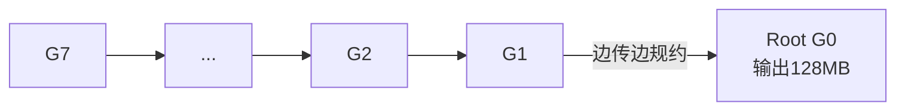
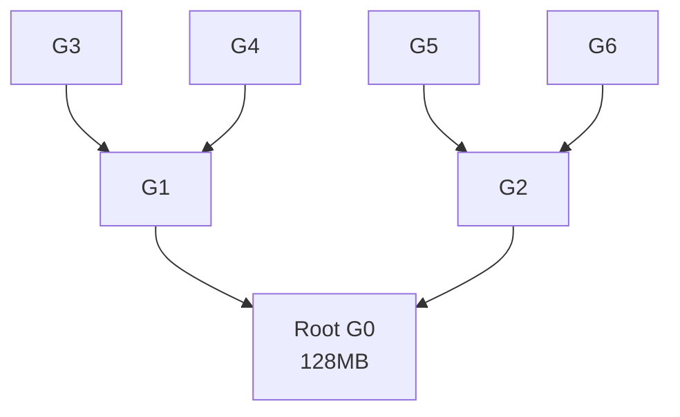

# Reduce · busBw 推导与手算

> 源码位置：`rccl-tests/src/reduce.cu` 第 37-41 行
> 统一场景：n = 8 GPU，rccl-tests 命令行 `-b 134217728`（count = 128 MB）

<div align="center">

<style>
* { box-sizing: border-box; margin: 0; padding: 0; }
  :root {
    --surface: #ffffff; --surface-muted: #f6f6fb; --surface-soft: #eef0f7;
    --border: #e2e2ec; --text: #1a1a2e; --text-muted: #6b6b80;
    --brand: #7c5cff; --brand-strong: #5b3fd6; --brand-soft: #efebff;
    --font-sans: -apple-system, "PingFang SC", "Noto Sans CJK SC", "WenQuanYi Micro Hei", sans-serif;
    --font-mono: "SF Mono", "JetBrains Mono", "Menlo", monospace;
    --radius: 8px; --radius-card: 12px; --weight-medium: 500; --weight-strong: 700;
  }
  .bw-root { font-family: var(--font-sans); color: var(--text); background: var(--surface); border:1px solid var(--border); border-radius: var(--radius-card); padding: 20px; width: 100%; max-width: 880px; }
  .bw-title { font-size: 16px; font-weight: var(--weight-strong); margin: 0 0 4px; }
  .bw-sub { font-size: 12px; color: var(--text-muted); margin: 0 0 16px; }
  .bw-grid { display: flex; gap: 20px; align-items: stretch; }
  .bw-ring { flex: 0 0 300px; }
  .bw-derive { flex: 1; display: flex; flex-direction: column; gap: 10px; }
  .bw-derive-head { font-size: 13px; font-weight: var(--weight-medium); color: var(--text-muted); letter-spacing: .04em; text-transform: uppercase; }
  .bw-step { display: flex; gap: 10px; align-items: baseline; font-size: 14px; line-height: 1.5; }
  .bw-step .n { flex: 0 0 22px; font-family: var(--font-mono); font-size: 12px; color: var(--brand-strong); font-weight: var(--weight-strong); }
  .bw-step .t { font-family: var(--font-mono); font-size: 13px; }
  .bw-step .d { font-size: 12px; color: var(--text-muted); }
  .bw-concl { margin-top: 6px; padding: 12px 14px; background: var(--brand-soft); border:1px solid var(--brand); border-radius: var(--radius); font-size: 14px; line-height: 1.5; }
  .bw-concl .k { font-family: var(--font-mono); font-weight: var(--weight-strong); color: var(--brand-strong); }
  .bw-concl .h { font-size: 12px; color: var(--text-muted); margin-top: 4px; }
  .bw-legend { display: flex; gap: 16px; font-size: 12px; color: var(--text-muted); margin-top: 10px; flex-wrap: wrap; }
  .bw-legend span b { color: var(--text); font-weight: var(--weight-medium); }
</style>

<div class="bw-root">
    <div class="bw-title">Tree Reduce · busBw 理论上限推导</div>
    <div class="bw-sub">源码 reduce.cu: factor = 1，n = 8 GPU，M = 128 MB</div>
    <div class="bw-grid">
      <div class="bw-ring">
        <svg viewBox="0 0 300 340" width="300" height="340" xmlns="http://www.w3.org/2000/svg">
          <defs>
            <marker id="ah" markerWidth="8" markerHeight="8" refX="7" refY="4" orient="auto">
              <path d="M1 1 L7 4 L1 7 Z" fill="#7c5cff"/>
            </marker>
          </defs>
          <!-- 树形连线 子→父 向上（规约） -->
          <g stroke="#7c5cff" stroke-width="2" fill="none">
            <line x1="101" y1="116" x2="139" y2="69"  marker-end="url(#ah)"/>
            <line x1="199" y1="116" x2="161" y2="69"  marker-end="url(#ah)"/>
            <line x1="63"  y1="189" x2="82"  y2="146" marker-end="url(#ah)"/>
            <line x1="117" y1="189" x2="98"  y2="146" marker-end="url(#ah)"/>
            <line x1="191" y1="188" x2="204" y2="147" marker-end="url(#ah)"/>
            <line x1="246" y1="190" x2="219" y2="145" marker-end="url(#ah)"/>
            <line x1="144" y1="263" x2="131" y2="222" marker-end="url(#ah)"/>
          </g>
          <!-- M=128MB 标注（root 旁） -->
          <g>
            <rect x="176" y="37" width="70" height="18" rx="6" fill="#efebff" stroke="#7c5cff" stroke-width="1"/>
            <text x="211" y="46" text-anchor="middle" dominant-baseline="central" font-size="11" fill="#1a1a2e">M=128MB</text>
          </g>
          <!-- 节点 -->
          <g font-size="12" fill="#1a1a2e" text-anchor="middle" dominant-baseline="central">
            <circle cx="150" cy="55"  r="18" stroke="#7c5cff" fill="#efebff" stroke-width="2"/><text x="150" y="55">G0</text>
            <circle cx="90"  cy="130" r="18" stroke="#7c5cff" fill="#ffffff" stroke-width="2"/><text x="90"  y="130">G1</text>
            <circle cx="210" cy="130" r="18" stroke="#7c5cff" fill="#ffffff" stroke-width="2"/><text x="210" y="130">G2</text>
            <circle cx="55"  cy="205" r="18" stroke="#7c5cff" fill="#ffffff" stroke-width="2"/><text x="55"  y="205">G3</text>
            <circle cx="125" cy="205" r="18" stroke="#7c5cff" fill="#ffffff" stroke-width="2"/><text x="125" y="205">G4</text>
            <circle cx="185" cy="205" r="18" stroke="#7c5cff" fill="#ffffff" stroke-width="2"/><text x="185" y="205">G5</text>
            <circle cx="255" cy="205" r="18" stroke="#7c5cff" fill="#ffffff" stroke-width="2"/><text x="255" y="205">G6</text>
            <circle cx="150" cy="280" r="18" stroke="#7c5cff" fill="#ffffff" stroke-width="2"/><text x="150" y="280">G7</text>
          </g>
          <!-- 底部标注 -->
          <g>
            <rect x="80" y="312" width="140" height="22" rx="6" fill="#efebff" stroke="#7c5cff" stroke-width="1"/>
            <text x="150" y="323" text-anchor="middle" dominant-baseline="central" font-size="12" fill="#1a1a2e">流水线树 · T ≈ M/B</text>
          </g>
        </svg>
      </div>
      <div class="bw-derive">
        <div class="bw-derive-head">推导链</div>
        <div style='font-family:"SF Mono","JetBrains Mono",Menlo,monospace;font-size:11px;color:#6b6b80;margin-top:-4px;'>源码 reduce.cu: baseBw = count·typesize/1e9/sec · factor = 1（隐式）· busBw = baseBw</div>
        <div class="bw-step"><span class="n">1</span><span class="t">M = 128 MB, n = 8</span><span class="d">每 rank 输入 128MB，root 输出 128MB 规约结果</span></div>
        <div class="bw-step"><span class="n">2</span><span class="t">log₂n = 3</span><span class="d">二叉树深度，流水线分块逐级上推规约</span></div>
        <div class="bw-step"><span class="n">3</span><span class="t">T ≈ M / B</span><span class="d">流水线实现，root 入向链路持续满载</span></div>
        <div class="bw-step"><span class="n">4</span><span class="t">algBw = M/T ≈ B</span><span class="d">算法带宽逼近单链路带宽</span></div>
        <div class="bw-step"><span class="n">5</span><span class="t">busBw = algBw × 1 = B ✓</span><span class="d">factor=1，root 入向链路瓶颈</span></div>
        <div class="bw-concl">
          <div class="k">busBw = B（流水线实现下）</div>
          <div class="h">Reduce 与 Broadcast 完全对称（all→1 vs 1→all）。AllReduce = Reduce + Broadcast，直接串联 busBw 会降到 B/2。</div>
        </div>
        <div class="bw-legend">
          <span>消息大小 <b>M=128MB</b></span>
          <span>树深 <b>log₂8=3</b></span>
          <span>流水线 <b>T≈M/B</b></span>
          <span>factor <b>1</b></span>
        </div>
      </div>
    </div>
  </div>

</div>

## 一、源码公式

```c
void ReduceGetBw(size_t count, int typesize, double sec,
                 double* algBw, double* busBw, int nranks) {
  double baseBw = (double)(count * typesize) / 1.0E9 / sec;
  *algBw = baseBw;
  *busBw = baseBw;
}
```

- `count` = paramcount = M（每 rank 输入 M，root 输出 M）
- `baseBw` = M / T
- **factor = 1（隐式，直接 busBw = baseBw）**

## 二、参数含义（用户 -b 128MB, n = 8）

ReduceGetCollByteCount 中 sendcount = recvcount = count。

| 量 | 计算 | 值 |
|----|------|-----|
| count (paramcount) | 用户 -b | 128 MB |
| sendcount / rank | = count | 128 MB |
| recvcount (root) | = count | 128 MB |

## 三、算法推导（树形规约）

Reduce 是 all→1 操作，Broadcast 的逆运算。RCCL 对大消息用 Ring，小消息用 Tree。

### Ring 规约（大消息）



- 数据沿环反向流动，每步规约
- 流水线下 root 的入向链路持续满载，T ≈ M/B
- busBw = algBw = M/T ≈ B

### 树形规约（小消息）



- 二叉树深度 = log₂n = 3
- 无流水线 T = 3M/B → busBw = B/3
- 流水线树 T ≈ M/B → busBw ≈ B

## 四、手算过程

设 B = 单向链路带宽，M = 128MB。按 RCCL 大消息流水线实现：

| 步骤 | 公式 | 代入 n=8, M=128MB | 结果 |
|------|------|-------------------|------|
| 1. 消息大小 | M | - | 128 MB |
| 2. 总时间 T（流水线）| M/B | 128/B | 128/B MB |
| 3. algBw | M/T | 128/(128/B) | B |
| 4. factor | 1 | - | 1 |
| 5. **busBw** | algBw × 1 | B × 1 | **= B** |

> 对比：无流水线二叉树 T = 3M/B，busBw = B/3 ≈ 0.333B。

## 五、理论上限结论

**busBw 理论上限 = B（单向链路带宽），在流水线实现下达成。**

- Reduce 与 Broadcast 完全对称：一个是 1→all，一个是 all→1
- factor = 1，因为 root 的入向链路是瓶颈，M 流经该链路一次
- busBw = algBw，无归一化系数

> **与 AllReduce 的关系**：AllReduce = Reduce（all→1）+ Broadcast（1→all）。若直接串联两棵树，busBw 上限会降到 B/2；Ring AllReduce 通过环形复用把两阶段合并，busBw 回到 B（但 factor 变为 2(n−1)/n 来补偿两阶段）。
