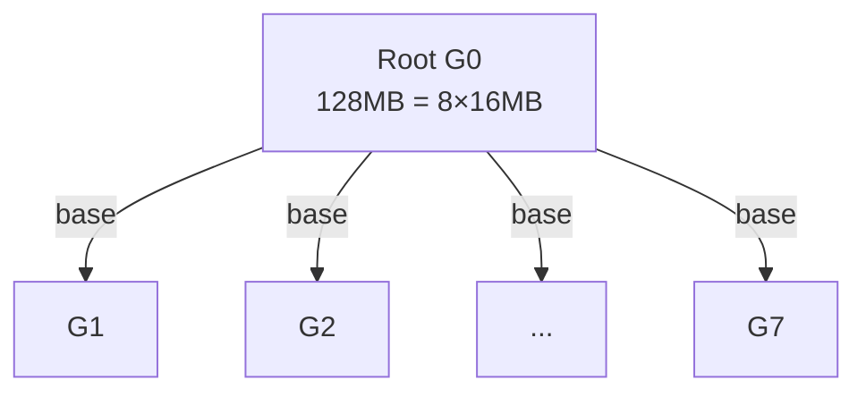

# Scatter · busBw 推导与手算

> 源码位置：`rccl-tests/src/scatter.cu` 第 35-41 行
> 统一场景：n = 8 GPU，rccl-tests 命令行 `-b 134217728`（count = 128 MB）

<div align="center">

<style>
* { box-sizing: border-box; margin: 0; padding: 0; }
  :root {
    --surface: #ffffff; --surface-muted: #f6f6fb; --surface-soft: #eef0f7;
    --border: #e2e2ec; --text: #1a1a2e; --text-muted: #6b6b80;
    --brand: #7c5cff; --brand-strong: #5b3fd6; --brand-soft: #efebff;
    --font-sans: -apple-system, "PingFang SC", "Noto Sans CJK SC", "WenQuanYi Micro Hei", sans-serif;
    --font-mono: "SF Mono", "JetBrains Mono", "Menlo", monospace;
    --radius: 8px; --radius-card: 12px; --weight-medium: 500; --weight-strong: 700;
  }
  .bw-root { font-family: var(--font-sans); color: var(--text); background: var(--surface); border:1px solid var(--border); border-radius: var(--radius-card); padding: 20px; width: 100%; max-width: 880px; }
  .bw-title { font-size: 16px; font-weight: var(--weight-strong); margin: 0 0 4px; }
  .bw-sub { font-size: 12px; color: var(--text-muted); margin: 0 0 16px; }
  .bw-grid { display: flex; gap: 20px; align-items: stretch; }
  .bw-ring { flex: 0 0 300px; }
  .bw-derive { flex: 1; display: flex; flex-direction: column; gap: 10px; }
  .bw-derive-head { font-size: 13px; font-weight: var(--weight-medium); color: var(--text-muted); letter-spacing: .04em; text-transform: uppercase; }
  .bw-step { display: flex; gap: 10px; align-items: baseline; font-size: 14px; line-height: 1.5; }
  .bw-step .n { flex: 0 0 22px; font-family: var(--font-mono); font-size: 12px; color: var(--brand-strong); font-weight: var(--weight-strong); }
  .bw-step .t { font-family: var(--font-mono); font-size: 13px; }
  .bw-step .d { font-size: 12px; color: var(--text-muted); }
  .bw-concl { margin-top: 6px; padding: 12px 14px; background: var(--brand-soft); border:1px solid var(--brand); border-radius: var(--radius); font-size: 14px; line-height: 1.5; }
  .bw-concl .k { font-family: var(--font-mono); font-weight: var(--weight-strong); color: var(--brand-strong); }
  .bw-concl .h { font-size: 12px; color: var(--text-muted); margin-top: 4px; }
  .bw-legend { display: flex; gap: 16px; font-size: 12px; color: var(--text-muted); margin-top: 10px; flex-wrap: wrap; }
  .bw-legend span b { color: var(--text); font-weight: var(--weight-medium); }
</style>

<div class="bw-root">
    <div class="bw-title">Scatter · busBw 理论上限推导</div>
    <div class="bw-sub">源码 scatter.cu: factor = (n−1)/n，n = 8 GPU，M = 128 MB</div>
    <div class="bw-grid">
      <div class="bw-ring">
        <svg viewBox="0 0 300 340" width="300" height="340" xmlns="http://www.w3.org/2000/svg">
          <defs>
            <marker id="ah" markerWidth="8" markerHeight="8" refX="7" refY="4" orient="auto">
              <path d="M1 1 L7 4 L1 7 Z" fill="#7c5cff"/>
            </marker>
          </defs>
          <!-- 根扇出连线 G0→Gi -->
          <g stroke="#7c5cff" stroke-width="2" fill="none">
            <line x1="76" y1="161" x2="219" y2="84"  marker-end="url(#ah)"/>
            <line x1="77" y1="166" x2="251" y2="122" marker-end="url(#ah)"/>
            <line x1="78" y1="170" x2="260" y2="170" marker-end="url(#ah)"/>
            <line x1="77" y1="174" x2="251" y2="218" marker-end="url(#ah)"/>
            <line x1="76" y1="179" x2="219" y2="256" marker-end="url(#ah)"/>
            <line x1="73" y1="182" x2="175" y2="280" marker-end="url(#ah)"/>
            <line x1="69" y1="185" x2="129" y2="283" marker-end="url(#ah)"/>
          </g>
          <!-- 每条箭头标注 base=16MB（白色描边保证可读） -->
          <g font-size="9" fill="#6b6b80" stroke="#ffffff" stroke-width="3" paint-order="stroke" text-anchor="middle" dominant-baseline="central">
            <text x="183" y="104">16MB</text>
            <text x="206" y="134">16MB</text>
            <text x="213" y="170">16MB</text>
            <text x="206" y="206">16MB</text>
            <text x="183" y="237">16MB</text>
            <text x="150" y="255">16MB</text>
            <text x="115" y="260">16MB</text>
          </g>
          <!-- root 标注 128MB = 8×16MB（G0 上方两行） -->
          <g font-size="10" fill="#5b3fd6" text-anchor="middle" dominant-baseline="central">
            <text x="60" y="128">128MB</text>
            <text x="60" y="142">= 8×16MB</text>
          </g>
          <!-- 节点 -->
          <g font-size="12" fill="#1a1a2e" text-anchor="middle" dominant-baseline="central">
            <circle cx="60"  cy="170" r="18" stroke="#7c5cff" fill="#efebff" stroke-width="2"/><text x="60"  y="170">G0</text>
            <circle cx="235" cy="75"  r="18" stroke="#7c5cff" fill="#ffffff" stroke-width="2"/><text x="235" y="75">G1</text>
            <circle cx="268" cy="118" r="18" stroke="#7c5cff" fill="#ffffff" stroke-width="2"/><text x="268" y="118">G2</text>
            <circle cx="278" cy="170" r="18" stroke="#7c5cff" fill="#ffffff" stroke-width="2"/><text x="278" y="170">G3</text>
            <circle cx="268" cy="222" r="18" stroke="#7c5cff" fill="#ffffff" stroke-width="2"/><text x="268" y="222">G4</text>
            <circle cx="235" cy="265" r="18" stroke="#7c5cff" fill="#ffffff" stroke-width="2"/><text x="235" y="265">G5</text>
            <circle cx="188" cy="292" r="18" stroke="#7c5cff" fill="#ffffff" stroke-width="2"/><text x="188" y="292">G6</text>
            <circle cx="138" cy="298" r="18" stroke="#7c5cff" fill="#ffffff" stroke-width="2"/><text x="138" y="298">G7</text>
          </g>
          <!-- 底部标注 -->
          <g>
            <rect x="80" y="321" width="140" height="16" rx="6" fill="#efebff" stroke="#7c5cff" stroke-width="1"/>
            <text x="150" y="329" text-anchor="middle" dominant-baseline="central" font-size="11" fill="#1a1a2e">根扇出 · 7 × 16 MB</text>
          </g>
        </svg>
      </div>
      <div class="bw-derive">
        <div class="bw-derive-head">推导链</div>
        <div style='font-family:"SF Mono","JetBrains Mono",Menlo,monospace;font-size:11px;color:#6b6b80;margin-top:-4px;'>源码 scatter.cu: baseBw = count·nranks·typesize/1e9/sec · factor = (n−1)/n · busBw = baseBw·factor</div>
        <div class="bw-step"><span class="n">1</span><span class="t">M = 128 MB, n = 8</span><span class="d">root 持有 8 段，每段 base = M/n = 16MB，分发给各 rank</span></div>
        <div class="bw-step"><span class="n">2</span><span class="t">(n−1)·base = 7×16MB</span><span class="d">root 向 7 个其他 rank 各发 base，共 112MB</span></div>
        <div class="bw-step"><span class="n">3</span><span class="t">T = (n−1)·M/(n·B)</span><span class="d">root 链路串行发送 (n−1) 份</span></div>
        <div class="bw-step"><span class="n">4</span><span class="t">algBw = M/T = n·B/(n−1) = 8B/7</span><span class="d">≈ 1.143 B</span></div>
        <div class="bw-step"><span class="n">5</span><span class="t">busBw = algBw × (n−1)/n = B ✓</span><span class="d">(8B/7)×(7/8) = B</span></div>
        <div class="bw-concl">
          <div class="k">busBw = B</div>
          <div class="h">Scatter 是 Broadcast 的分片版——Broadcast 发完整 M，Scatter 发 M/n。root 链路只传 (n−1)/n·M，factor 抵消这层差异。</div>
        </div>
        <div class="bw-legend">
          <span>每 rank 接收 <b>base=16MB</b></span>
          <span>root 发送份数 <b>n−1=7</b></span>
          <span>root 总传输 <b>7×16=112MB</b></span>
          <span>factor <b>(n−1)/n=0.875</b></span>
        </div>
      </div>
    </div>
  </div>

</div>

## 一、源码公式

```c
void ScatterGetBw(size_t count, int typesize, double sec,
                  double* algBw, double* busBw, int nranks) {
  double baseBw = (double)(count * nranks * typesize) / 1.0E9 / sec;
  *algBw = baseBw;
  double factor = ((double)(nranks-1))/((double)(nranks));
  *busBw = baseBw * factor;
}
```

- `count` = paramcount = base = 每 rank **接收**的字节数
- `baseBw` = base × n / T = root 发送总量 / T
- `factor` = (n−1)/n

## 二、参数含义（用户 -b 128MB, n = 8）

ScatterGetCollByteCount 中：`recvcount = count/nranks`，root 持有 n 份分发给各 rank。

| 量 | 计算 | 值 |
|----|------|-----|
| 用户 -b count | 原始指定 | 128 MB |
| base = paramcount | count/n | 16 MB（每 rank 接收）|
| sendcount (root) | = base×n | 128 MB（root 发送总量）|
| recvcount / rank | = base | 16 MB |
| baseBw 对应数据 | paramcount×n | 128 MB |

## 三、算法推导（树形/环形 Scatter）

Scatter 是 1→all 分发：root 将 n 段（每段 base）分发给各 rank。root 出向链路是瓶颈。



- root 需向 n−1 个其他 rank 各发 base，共 (n−1)×base = 112MB
- root 出向链路串行发送，T = (n−1)×base/B
- 总时间：

```
T = (n-1) × base / B = 7 × 16MB / B = 112 MB / B
```

> 注：RCCL 实际用树形分摊 root 负载（已收到数据的 rank 帮忙转发），但 root 出向链路仍需首发 (n−1)×base，流水线下 T 仍为 (n−1)×base/B。

## 四、手算过程

设 B = 单向链路带宽，M = 128MB（root 发送总量 = base×n）。

| 步骤 | 公式 | 代入 n=8, M=128MB | 结果 |
|------|------|-------------------|------|
| 1. 每 rank 接收 | base = M/n | 128/8 | 16 MB |
| 2. root 发送份数 | n−1 | 8−1 | 7 |
| 3. 总时间 T | (n−1)·base/B = (n−1)·M/(nB) | 7×128/(8B) | 112/B MB |
| 4. algBw (baseBw) | M/T | 128/(112/B) | 8B/7 ≈ 1.143 B |
| 5. factor | (n−1)/n | 7/8 | 0.875 |
| 6. **busBw** | algBw × factor | (8B/7)×(7/8) | **= B** |

## 五、理论上限结论

**busBw 理论上限 = B（单向链路带宽），与 n、M 无关。**

- Scatter 是 Broadcast 的"分片版"：Broadcast 给每个 rank 发完整 M，Scatter 给每个 rank 发 M/n
- root 出向链路转发 (n−1)×base = (n−1)/n × M，正好是 M 的 (n−1)/n
- factor = (n−1)/n 把 algBw（基于 M）归一化到 root 链路实际负载，得 busBw = B

> **对比 Broadcast**：Broadcast factor=1（root 链路传完整 M），Scatter factor=(n−1)/n（root 链路只传 (n−1)/n·M，因为不传给自己那一份）。两者 busBw 上限同为 B。
